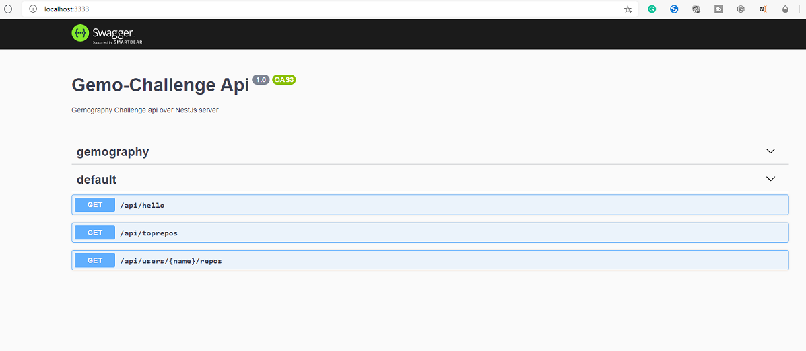

# Gemo Backend Challenge

[](https://dev.azure.com/cherkaouimouad/gemo-challenge/_build/latest?definitionId=48&branchName=master)

Backend challenge project using NestJS & Angular.
<p align="center"></p>

🔎 **This project was generated using [Nx](https://nx.dev)  *a set of Extensible Dev Tools for Monorepos.***

## Getting Started

These instructions will get you a copy of the project up and running on your local machine for development and testing purposes. See deployment for notes on how to deploy the project on a live system.

### Prerequisites

- nodejs 8
- @angular/cli
- @nrwl/cli
- firebase-tools

### Installing

A step by step series of examples that tell you how to get a development env running

First we need to install the angular/cli:

```
$: npm i -g @angular/cli 
```

Next the Narwel Nx cli:

```
$: npm i -g @nrwl/cli
```

Finally firebase tools:

```
$: npm i -g @firebase-tools
```
the last step is to configure firebase for our project, you can replace the project id in the .firebaserc file, or simple remove it and start new one:

```
$: firebase login
$: ## 
$: firebase init
$: ## while initializing the project you should configure 
$: ## the public folder to point to dist/apps/challenge
$: ##
```

## Running the project

we can the project without firebase emulation using:
```bash 
$: nx serve api # for the api project
  # and 
$: nx serve challenge # for the client application
  # since this is an angular-cli project you still able to run it using ng serve
```
you can test the api at http://localhost:3333 when you will be able to check the swagger-ui page documenting the Api.

<p align="center"></p>

To run using the firebase emulator: 

First we build both the back and front ends: 

```bash
$: # the backend 
$: nx build api
$: # and the frontend
$: nx build challenge
``` 
now we can launch the emulator:
```bash
  # since the firebase config rely on the dist folder content you need to build the projects through:
  #  nx build api & nx build challenge
$: firebase serve
```

### Break down into end to end tests

Explain what these tests test and why

```
Give an example
```

### And coding style tests

Explain what these tests test and why

```
Give an example
```

## Deployment

Add additional notes about how to deploy this on a live system

## Built With

* [Nx](https://nx.dev/) - Used for monorepo generation workspace management
* [NestJS](https://nestjs.com/) - Used for the backend Api
* [Angular](https://angular.io/) - Used for the frontend 
* [Project Clarity](https://clarity.design/) - Used for the frontend styling and angular components 

## Authors

* **Mouad Cherkaoui** - *Initial work* - [mouadcherkaoui](https://github.com/mouadcherkaoui)

## License

This project is licensed under the MIT License - see the [LICENSE.md](LICENSE.md) file for details

## Acknowledgments

* Hat tip to anyone whose code was used
* Inspiration
* etc
